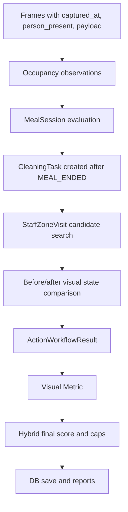

# Integrated Project Demo Report

## 1. Document Purpose

This report explains the current integrated project as a single demoable system.

The focus is:

- what can be demonstrated today
- how the demo flows from screen to screen
- what algorithm, model, and metric is used at each step
- how results are stored and shown again in reports

This is a description of the current implemented project state, not a proposal for a future redesign.

## 2. System Summary

The project is a FastAPI-based store monitoring and cleanliness analysis system.

It combines several flows:

1. ROI setup and store/CCTV configuration
2. image-based cleanliness scoring
3. video-based cleanliness scoring
4. person masking and occupancy estimation
5. action-based table cleaning judgment
6. workflow-style cleaning judgment from image sequences or short videos
7. hybrid final scoring
8. DB persistence and reports visualization

At a high level, the project mixes:

- OpenAI/VLM-based semantic judgment
- local person segmentation
- rule-based workflow/state transitions
- visual penalty/bonus scoring
- DB-backed reporting

## 3. Main Demo Screens and APIs

Main screens:

- [Stores](/C:/Folder/Class/ug4-1/yachaSW/20261R0136COSE45700/app/main.py#L193)
- [ROI Setup](/C:/Folder/Class/ug4-1/yachaSW/20261R0136COSE45700/app/main.py#L203)
- [Cleanliness](/C:/Folder/Class/ug4-1/yachaSW/20261R0136COSE45700/app/main.py#L903)
- [Person Mask](/C:/Folder/Class/ug4-1/yachaSW/20261R0136COSE45700/app/main.py#L1175)
- [Action Cleanliness](/C:/Folder/Class/ug4-1/yachaSW/20261R0136COSE45700/app/main.py#L1200)
- [Action Workflow Demo](/C:/Folder/Class/ug4-1/yachaSW/20261R0136COSE45700/app/main.py#L1244)
- [Hybrid Cleanliness](/C:/Folder/Class/ug4-1/yachaSW/20261R0136COSE45700/app/main.py#L1473)
- [Reports](/C:/Folder/Class/ug4-1/yachaSW/20261R0136COSE45700/app/main.py#L1739)

Main workflow APIs:

- [POST `/api/action-cleanliness/workflow`](/C:/Folder/Class/ug4-1/yachaSW/20261R0136COSE45700/app/main.py#L1345)
- [POST `/api/action-cleanliness/workflow-from-images`](/C:/Folder/Class/ug4-1/yachaSW/20261R0136COSE45700/app/main.py#L1350)
- [POST `/api/action-cleanliness/workflow-from-video`](/C:/Folder/Class/ug4-1/yachaSW/20261R0136COSE45700/app/main.py#L1409)
- [POST `/api/mobile/cleanliness-video`](/C:/Folder/Class/ug4-1/yachaSW/20261R0136COSE45700/app/main.py#L1106)

## 4. End-to-End Demo Story

The most understandable demo order is:

1. define store/CCTV/ROI
2. show single-image cleanliness scoring
3. show person masking
4. show action-only cleaning logic
5. show workflow demo from images or video
6. show final records in reports

That sequence makes the audience understand:

- where spatial context comes from
- how visual evidence is extracted
- how occupancy is derived
- how rule-based cleaning judgment works
- how final scores are saved and displayed

## 5. Demo Flow in Detail

### 5.1 Step 1: Store and ROI Setup

User-visible flow:

1. open `Stores`
2. create or select a store
3. open `ROI Setup`
4. upload a reference image
5. define one or more polygon ROIs
6. save CCTV config

Core files:

- [app/roi_store.py](/C:/Folder/Class/ug4-1/yachaSW/20261R0136COSE45700/app/roi_store.py)
- [app/schemas.py](/C:/Folder/Class/ug4-1/yachaSW/20261R0136COSE45700/app/schemas.py)
- [app/static/roi-editor.js](/C:/Folder/Class/ug4-1/yachaSW/20261R0136COSE45700/app/static/roi-editor.js)

What happens internally:

- ROI points are normalized into a consistent structure
- config is stored as JSON under `data/roi_configs`
- reference images are stored under `data/reference_images`

Why this matters in the demo:

- every later analysis depends on the ROI
- the audience understands that the system is not analyzing the whole camera blindly
- ROI is the spatial anchor for object, cleanliness, and occupancy reasoning

### 5.2 Step 2: Single-Image Cleanliness Demo

User-visible flow:

1. open `Cleanliness`
2. choose a CCTV config and ROI
3. upload one image
4. inspect the returned cleanliness result

Core implementation:

- [CleanlinessService.inspect_image()](/C:/Folder/Class/ug4-1/yachaSW/20261R0136COSE45700/app/cleanliness.py#L194)
- [POST `/cleanliness`](/C:/Folder/Class/ug4-1/yachaSW/20261R0136COSE45700/app/main.py#L922)

Model/component used:

- OpenAI VLM through the cleanliness client

Input:

- source image
- ROI crop
- prompt profile such as `restaurant`

Output:

- `score` from 1 to 5
- `confidence`
- `summary`
- `findings`
- `exact_objects`
- `estimated_objects`

Algorithmic idea:

- the ROI crop is the primary evidence
- the model is asked to score cleanliness strictly on a 1 to 5 scale
- visible trash, wrappers, crumbs, spills, or food residue push the score downward
- uncertainty lowers confidence rather than forcing a fake precise result

Why this demo matters:

- it is the simplest visual explanation of the project
- it shows the project can turn an ROI image into an interpretable cleanliness judgment

### 5.3 Step 3: Person Masking Demo

User-visible flow:

1. open `Person Mask`
2. upload an image with or without people
3. inspect the masked output and person count

Core implementation:

- [PersonMaskService](/C:/Folder/Class/ug4-1/yachaSW/20261R0136COSE45700/app/person_masking.py#L209)

Model/component used:

- local person segmentation / masking pipeline

Output includes:

- `person_count`
- `detections`
- masked image path
- masked pixel ratio

Why this matters for the full story:

- later workflow demos need `person_present` and `person_count`
- this is the bridge from raw image evidence to occupancy interpretation

### 5.4 Step 4: Action-Only Cleaning Demo

User-visible flow:

1. open `Action Cleanliness`
2. choose ROI
3. enter trajectory JSON
4. enter order and payment-completed time
5. run action-only judgment

Core implementation:

- [ActionCleanlinessService](/C:/Folder/Class/ug4-1/yachaSW/20261R0136COSE45700/app/action_cleanliness.py#L471)
- [POST `/action-cleanliness`](/C:/Folder/Class/ug4-1/yachaSW/20261R0136COSE45700/app/main.py#L1263)

Main action features:

- near-table dwell time
- stopped seconds
- coverage ratio
- visited sides
- approach count
- side transition count
- order-to-payment exclusion window

Key idea:

- this is not visual cleanliness
- it is behavior-based evidence about whether a staff member likely performed cleaning behavior around the table

Why it is useful in the demo:

- it separates “clean-looking image” from “cleaning action happened”
- that becomes important when the workflow combines action evidence and visual evidence

### 5.5 Step 5: Workflow Demo from Image Sequence

User-visible flow:

1. open `Action Workflow Demo`
2. upload multiple images
3. enter:
   - `store_id`
   - `table_id`
   - `zone_id`
   - `captured_at_start`
   - `interval_seconds`
4. optionally enter `staff_zone_visits_json`
5. choose a visual preset or provide raw visual payloads
6. run the workflow
7. inspect returned JSON

Core implementation:

- [GET `/action-workflow-demo`](/C:/Folder/Class/ug4-1\yachaSW/20261R0136COSE45700/app/main.py#L1244)
- [POST `/api/action-cleanliness/workflow-from-images`](/C:/Folder/Class/ug4-1/yachaSW/20261R0136COSE45700/app/main.py#L1350)
- [build_workflow_frames_from_images()](/C:/Folder/Class/ug4-1/yachaSW/20261R0136COSE45700/app/vision_workflow_preprocessor.py#L62)
- [build_workflow_frame_from_image()](/C:/Folder/Class/ug4-1/yachaSW/20261R0136COSE45700/app/vision_workflow_preprocessor.py#L21)

Internal sequence:

1. uploaded images are stored temporarily
2. each image is assigned a deterministic timestamp
3. each image is passed through person masking
4. `person_present` and `person_count` are derived
5. a frame payload is attached
6. frames are converted into the workflow request structure
7. the existing workflow engine is called

This means the demo is not a mock UI only.
It is a real bridge from image sequence input to workflow inference.

### 5.6 Step 6: Workflow Demo from Short Video

User-visible flow:

1. open `Action Workflow Demo`
2. choose the short video section
3. upload one video
4. set:
   - `captured_at_start`
   - `interval_seconds`
   - `max_frames`
5. run the workflow

Core implementation:

- [POST `/api/action-cleanliness/workflow-from-video`](/C:/Folder/Class/ug4-1/yachaSW/20261R0136COSE45700/app/main.py#L1409)
- [build_workflow_frames_from_video()](/C:/Folder/Class/ug4-1/yachaSW/20261R0136COSE45700/app/vision_workflow_preprocessor.py#L137)
- [sample_video_workflow_frames()](/C:/Folder/Class/ug4-1/yachaSW/20261R0136COSE45700/app/vision_workflow_preprocessor.py#L107)

Internal sequence:

1. the video is stored temporarily
2. frames are sampled at a fixed interval
3. each sampled frame gets a deterministic timestamp from `captured_at_start + offset`
4. each frame reuses the same image-based workflow preprocessor
5. the final frame list is fed into the workflow engine

Why this is important:

- it demonstrates that the workflow is not limited to pre-structured JSON
- it shows the project can convert raw temporal media into workflow-ready evidence

## 6. Action Workflow: Logical Structure

The core workflow execution is here:

- [execute_action_cleanliness_workflow()](/C:/Folder/Class/ug4-1/yachaSW/20261R0136COSE45700/app/main.py#L630)
- [evaluate_meal_session()](/C:/Folder/Class/ug4-1/yachaSW/20261R0136COSE45700/app/action_cleanliness.py#L621)
- [evaluate_cleaning_task()](/C:/Folder/Class/ug4-1/yachaSW/20261R0136COSE45700/app/action_cleanliness.py#L759)

The workflow can be described as:



### 6.1 Meal Status Logic

Meal session logic uses occupancy over time.

Implemented behavior:

- long-enough continuous occupancy becomes `CUSTOMER_IN_USE`
- persistent absence after a confirmed meal becomes `MEAL_ENDED`

Important thresholds:

- default candidate/confirmation base: about 60 seconds for legacy-compatible behavior
- long-dwell mode is supported through optional configuration
- meal-end absence threshold: 90 seconds

This is important in the demo because:

- a single frame with a person does not automatically mean “meal in progress”
- time continuity is part of the state transition

### 6.2 Cleaning Candidate Logic

After meal end:

- a cleaning task is created
- staff zone visits are searched
- same-zone dwell must exceed the candidate threshold

Current threshold:

- same zone staff dwell of 10 seconds or more can become a cleaning candidate

### 6.3 State Change Logic

The table is considered visually changed when one or more of these is true:

- mess score decreases enough
- total detected object count decreases
- clutter object count decreases
- explicit cleanup evidence exists

Important guardrail:

- staff presence alone does not produce `CLEANED_LIKELY`
- a post-cleaning visual improvement signal is also required

## 7. Visual Metric

Core implementation:

- [build_visual_metric_result()](/C:/Folder/Class/ug4-1/yachaSW/20261R0136COSE45700/app/cleanliness_metric.py#L52)

Visual Metric formula:

```text
visual_score = 100 - visual_penalties + visual_bonuses
visual_score = clamp(0, 100)
visual_clean_score = visual_score / 100
visual_mess_score = 1 - visual_clean_score
```

### 7.1 Penalty Rules

Penalties currently include:

- trash-like objects: `-5` per object, capped at `-30`
- visible contamination: `-10`
- contamination area ratio:
  - `>= 5%`: `-5`
  - `>= 10%`: `-10`
  - `>= 20%`: `-20`
- messy arrangement: `-10`
- hazardous contamination: `-20`
- dirty duration persistence:
  - `>= 5 min`: `-5`
  - `>= 10 min`: `-10`
  - `>= 20 min`: `-15`

### 7.2 Bonus Rules

Bonuses currently include:

- removed objects or contamination removed: `+10`
- clear cleaning action evidence: `+10`

### 7.3 Reason Codes and Grade

The visual result also includes:

- penalty and bonus breakdowns
- `reason_codes`
- `visual_metric_grade`

Grade mapping:

- `A`: `90~100`
- `B`: `70~89`
- `C`: `50~69`
- `D`: `30~49`
- `E`: `0~29`

### 7.4 Object Adapter

The visual metric does not require one rigid object format.

Supported raw forms:

- `objects`
- `detected_objects`
- `yolo_objects`

Core adapter:

- [normalize_visual_metric_input()](/C:/Folder/Class/ug4-1/yachaSW/20261R0136COSE45700/app/cleanliness_metric.py#L126)

Alias examples:

- `trash`, `litter` -> `trash`
- `paper`, `wrapper` -> `wrapper`
- `tissue`, `napkin` -> `napkin`
- `leftover`, `food_residue` -> `food_waste`

Special rule:

- `person` sets `person_exposed=true`
- `person` does not directly create a cleanliness penalty

## 8. Final Score and Cap Rules

Core implementation:

- [build_final_cleanliness_result()](/C:/Folder/Class/ug4-1/yachaSW/20261R0136COSE45700/app/hybrid_cleanliness.py#L151)

Base fusion:

```text
final_raw_score = 100 * (0.5 * visual_clean_score + 0.5 * action_score)
```

So the current workflow branch is explicitly balanced:

- 50% visual condition
- 50% action evidence

Then cap rules are applied.

Current caps:

- `HIGH_YOLO_MESS_CAP_35`
- `MISSED_SUSPECTED_CAP_30`
- `NEED_CLEANING_CAP_55`
- `CLEANING_UNVERIFIED_CAP_70`
- `LOW_VISUAL_CONFIDENCE_CAP_60`

This means the final score is not just an average.
Operational risk rules can force the score down even when one branch looks good.

### 8.1 Final Grade Mapping

Current final score interpretation:

- `>= 80`: `정상`
- `>= 60`: `확인 필요`
- `>= 40`: `청소 필요`
- `< 40`: `청소 누락 의심`

Final decisions:

- `CLEAN_OK`
- `CHECK_REQUIRED`
- `CLEANING_REQUIRED`
- `CLEANING_MISSED_SUSPECTED`

## 9. Hybrid Cleanliness Page

User-visible flow:

1. open `Hybrid Cleanliness`
2. upload a single ROI image
3. optionally provide action trajectory
4. get a final result

Core implementation:

- [build_hybrid_cleanliness_result()](/C:/Folder/Class/ug4-1/yachaSW/20261R0136COSE45700/app/hybrid_cleanliness.py#L93)

Logic:

- object/VLM confidence is checked first
- if visual/object confidence is high enough, use object result
- if confidence is low, fall back to action result

Threshold:

- object confidence threshold: `0.6`

This page is good in a demo when you want to explain:

- “high-confidence visual cases can be decided directly”
- “ambiguous visual cases can defer to action evidence”

## 10. Video Cleanliness Flow

Core implementation:

- [VideoCleanlinessService.inspect_video()](/C:/Folder/Class/ug4-1/yachaSW/20261R0136COSE45700/app/video_cleanliness.py#L172)

This flow is different from the action workflow demo video.

What it does:

- builds a contact sheet from a video ROI
- sends the contact sheet to the OpenAI-based cleanliness analysis flow
- stores the result as a queued/background video cleanliness record

This is important in the demo because there are actually two distinct video stories:

1. `mobile cleanliness video`
   - semantic cleanliness analysis from a video ROI
2. `workflow-from-video`
   - sampled frames converted into occupancy + action workflow input

They are related, but not the same pipeline.

## 11. DB Persistence and Reports

Core DB functions:

- [app/database.py](/C:/Folder/Class/ug4-1/yachaSW/20261R0136COSE45700/app/database.py)

Reports entry point:

- [GET `/reports`](/C:/Folder/Class/ug4-1/yachaSW/20261R0136COSE45700/app/main.py#L1739)

Storage approach:

- object cleanliness results are stored in `cleanliness_results`
- video cleanliness results are stored in the same table with mode-specific fields
- action workflow results are also stored in `cleanliness_results`

For action workflow records:

- `mode = "action_workflow"`
- report-compatible `score` is stored on a 1~5 scale
- full workflow detail remains in `action_features`
- `final_cleanliness_score` 0~100 is preserved in JSON

Reports UI behavior:

- shows summary by store
- shows detailed rows
- for `action_workflow`, also expands:
  - final 0~100 score
  - cleaning status
  - action score
  - visual score
  - applied caps
  - reason codes
  - explanation

This makes the reports page the final demo destination.

## 12. Current Role of YOLO in the Integrated Project

The merged branch now contains:

- [app/yolo_module.py](/C:/Folder/Class/ug4-1/yachaSW/20261R0136COSE45700/app/yolo_module.py)
- `ultralytics` in [requirements.txt](/C:/Folder/Class/ug4-1/yachaSW/20261R0136COSE45700/requirements.txt)
- YOLO weight files in the repository root

However, it is important to explain this honestly during a demo:

- the YOLO module exists in the integrated codebase
- the current main demo flow is still primarily driven by:
  - OpenAI/VLM cleanliness scoring
  - person masking
  - workflow/visual metric logic
- the YOLO helper is not yet the dominant default path in the currently demonstrated UI flow

So in presentation terms:

- YOLO capability is present in the integrated branch
- but the primary end-to-end demo remains the workflow/VLM/person-masking pipeline

## 13. Recommended Demo Script Without a Separate Script File

The most stable live demo order is:

1. `Stores` / `ROI Setup`
   - define the spatial context
2. `Cleanliness`
   - show single-image semantic cleanliness scoring
3. `Person Mask`
   - show person detection and masking
4. `Action Cleanliness`
   - show behavior-based staff cleaning evidence
5. `Action Workflow Demo`
   - upload image sequence or short video
   - show frame generation, occupancy inference, action status, visual score, final score
6. `Reports`
   - show persistence and operational readability

If time is short, the best compact demo is:

1. `Action Workflow Demo`
2. `Reports`
3. `Cleanliness`
4. `Person Mask`

That order shows outcome first, then explains the ingredients.

## 14. Key Message to Communicate in the Demo

The strongest way to explain the system is:

- this project is not a single-model classifier
- it is a layered decision pipeline

Those layers are:

1. spatial context from ROI setup
2. visual semantics from VLM cleanliness scoring
3. human occupancy evidence from person masking
4. operational behavior evidence from action logic
5. visual penalty/bonus normalization from Visual Metric
6. conservative operational caps for final decision safety
7. DB-backed reporting for post-analysis use

That framing helps an audience understand why the project is more robust than a one-shot image score.

## 15. Current Strengths and Honest Limits

Current strengths:

- multiple demoable entry points
- full flow from raw upload to persisted report
- interpretable scoring and reason codes
- deterministic workflow states
- image and video support

Current limits:

- some visual workflow demos rely on preset or structured payload assistance
- YOLO exists in the branch but is not yet the dominant default demo path
- the project still mixes model-based and rule-based evidence, so explanation quality matters in demos

## 16. Conclusion

The current integrated project is best understood as a multi-stage store cleanliness and cleaning-workflow evaluation system.

Its most demoable story is:

- define ROI
- upload visual evidence
- derive occupancy
- evaluate meal end and cleaning candidate logic
- score visual cleanliness
- fuse action and visual evidence
- store and display results in reports

That is the clearest explanation of what the project does today and how the internal algorithms and metrics support the final decision.
