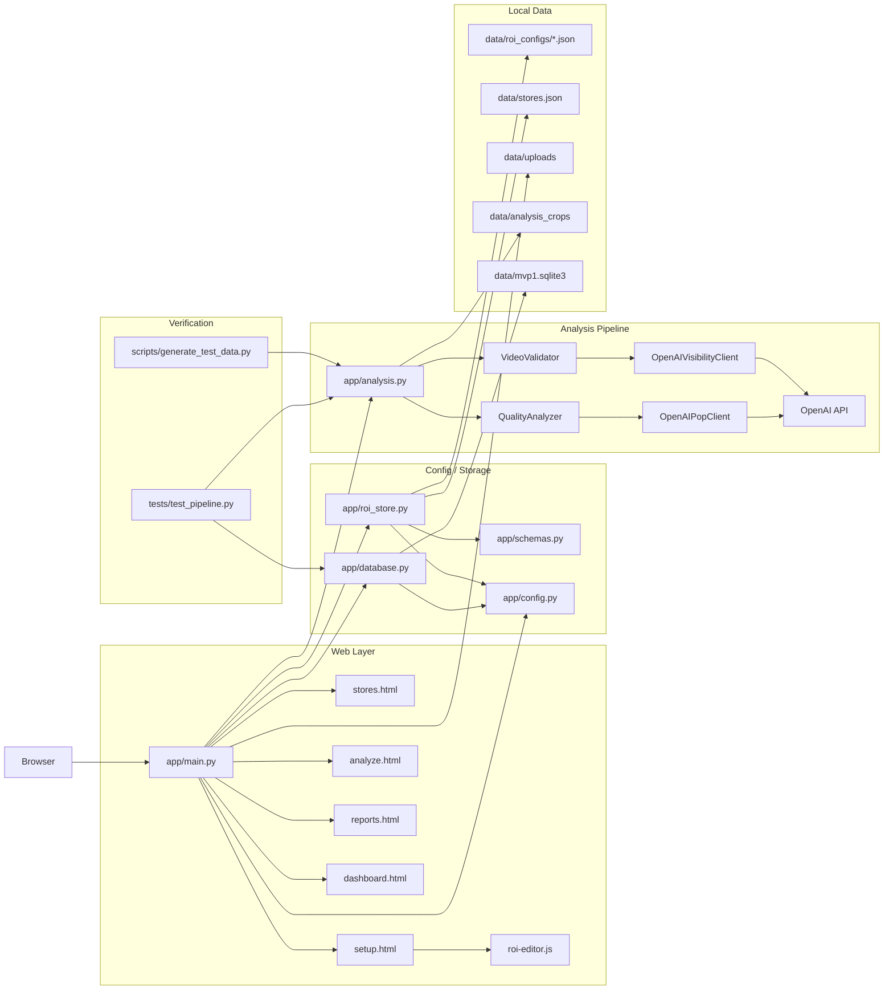
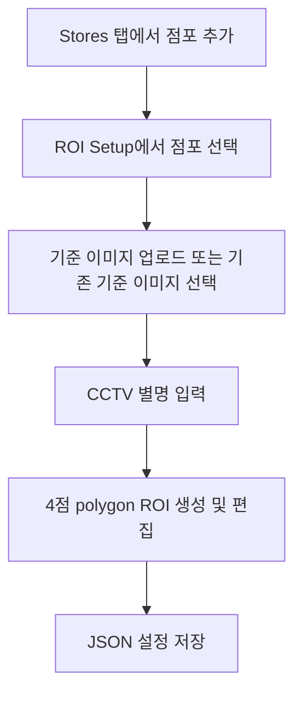
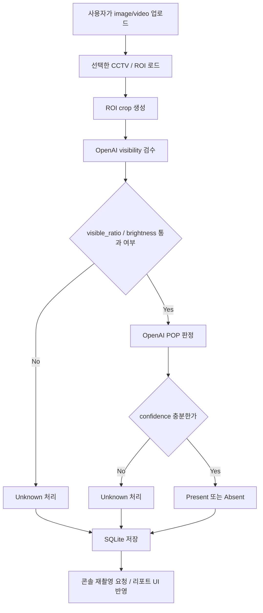

# MVP1 기획 및 구현 정리

## 1. 기획서 요약

이 프로젝트는 프랜차이즈 본사가 매장 운영 상태를 더 자주, 더 객관적으로 파악하기 위해 만든 MVP1이다.  
핵심 대상은 고정 CCTV 기준 ROI이며, 초기 범위는 다음 두 항목에 집중한다.

- 신상품/목표 포스터(POP) 존재 여부 판정
- 판정 불가 시 `Unknown` 처리 및 재촬영 요청

MVP1의 중심 가정은 다음과 같다.

- 한 점포 아래에 여러 CCTV가 존재할 수 있다.
- 한 CCTV 아래에 여러 ROI가 존재할 수 있다.
- ROI 이름은 해당 CCTV 안에서 중복되지 않는다.
- ROI는 사각형이 아니라 4점 polygon이며, 실제로는 사다리꼴 형태를 가질 수 있다.
- 점주는 원본 영상을 직접 수정하지 않고, 새 영상 증거를 다시 제출하는 방식으로만 결과를 보완한다.

## 2. 이 기획이 필요한 이유

기존 프랜차이즈 운영 점검 방식은 다음 문제를 안고 있다.

- 슈퍼바이저 방문은 비용이 크고 빈도를 높이기 어렵다.
- 체크리스트와 사진 보고는 점주 주관과 선택 편향이 개입된다.
- CCTV를 사람이 직접 보면 확장성이 낮다.
- 매출 같은 수치만으로는 현장 실행 품질을 파악하기 어렵다.

이 MVP1은 그중에서도 가장 좁고 검증 가능한 문제부터 자른다.

- POP가 붙어 있는가
- 지정 ROI가 사람에게 가려져 판정 불가인가
- 영상이 너무 어두운가

즉, 본 시스템은 “매장 전반 품질 관리 플랫폼”의 완성형이 아니라,  
`고정 CCTV ROI -> POP 판정 -> Unknown 처리 -> 재촬영 요청 -> 리포트 저장` 흐름을 먼저 성립시키는 실험 가능한 첫 단계다.

## 3. 현재 구현 범위

현재 코드 기준으로 실제 구현된 범위는 아래와 같다.

- FastAPI 기반 로컬 웹 서버
- 점포 추가 UI
- 점포 선택 기반 CCTV/ROI 설정 UI
- 4점 polygon ROI 편집 및 저장
- ROI 좌표 정규화
- 저장된 ROI 기준 image/video 업로드 분석
- OpenAI 기반 사람 신체 점유율 visibility 검수
- OpenAI 기반 POP 존재 여부 판정
- `Present / Absent / Unknown` 저장
- SQLite 기반 결과 저장
- 리포트 조회 UI
- 이미지 입력 시 실제 분석 crop 결과 표시

현재 구현은 MVP1 기획의 일부만 충족한다.  
특히 “자동 주기 분석”, “다시간대 병합”, “점주용 알림 채널”, “자연어 기반 정렬”, “하루 단위 통합 리포트”는 아직 없다.

## 4. 구현 아키텍처

현재 코드는 `웹 계층`, `설정/저장`, `분석 파이프라인`, `검증/테스트 자산`으로 나뉜다.

## 5. 모듈별 역할

- `app/main.py`: FastAPI 라우트와 화면 렌더링, 업로드 처리, 분석 실행 진입점을 담당한다.
- `app/analysis.py`: ROI crop, visibility 검수, POP 판정, 콘솔 알림, 결과 저장까지 전체 분석 파이프라인을 담당한다.
- `app/config.py`: 경로, OpenAI 설정, threshold, 샘플링 간격 같은 실행 설정을 관리한다.
- `app/database.py`: SQLite 테이블 생성과 분석 결과 저장/조회 쿼리를 담당한다.
- `app/roi_store.py`: 점포/CCTV/ROI 설정 JSON과 기준 이미지를 저장하고 읽는다.
- `app/schemas.py`: `Point`, `ROI`, `CCTVConfig` 데이터 구조와 ROI 점 정규화 규칙을 정의한다.
- `app/templates/*`: 로컬 운영 UI 화면을 제공한다.
- `app/static/roi-editor.js`: 4개 점 polygon ROI 편집 로직을 담당한다.
- `scripts/generate_test_data.py`: 기준 이미지, 정상/차폐/어두운 테스트 데이터를 생성한다.
- `tests/test_pipeline.py`: 가짜 OpenAI 컴포넌트를 사용해 파이프라인이 기대값과 맞는지 검증한다.

## 6. 현재 동작 흐름

### 6.1 ROI 설정 흐름

현재 저장 구조는 `store -> cctv -> roi` 이다.  
ROI는 `{name, points[4]}`로 저장되며, 점 순서는 `(x, y)` 기준 시작점 + 반시계 방향으로 정규화된다.

### 6.2 분석 흐름

### 6.3 현재 검수 로직

현재 visibility 검수는 기준 이미지 diff가 아니라, ROI crop 안에서 사람 신체가 얼마나 영역을 차지하는지 OpenAI가 직접 판단한다.

- image 입력: crop 1장을 OpenAI에 보내 `human_body_ratio`를 받는다.
- video 입력: `min(0.1초에 해당하는 프레임 수, 24)` 간격으로 프레임을 샘플링해 각 프레임의 `human_body_ratio`를 받는다.
- `visible_ratio = 1 - human_body_ratio`
- 추가 reject 조건은 현재 `too_dark` 뿐이며, blur 처리는 제거된 상태다.

### 6.4 현재 POP 판정 로직

현재 POP 판정은 OpenCV 템플릿 매칭이 아니라 OpenAI API 기반이다.

- 입력 1: 목표 포스터 템플릿 이미지
- 입력 2: ROI crop image 또는 crop video
- 출력: `Present / Absent / Unknown`, `confidence`, `summary`

validator가 reject한 경우 POP 분석은 실행하지 않고 바로 `Unknown`으로 처리한다.

## 7. 현재 저장되는 정보

SQLite에는 현재 다음 정보가 저장된다.

- 분석 시각(시간 단위 truncation)
- 점포명
- CCTV ID / CCTV 별명
- ROI 이름
- 항목 타입(`POP`)
- 판정 결과(`Present`, `Absent`, `Unknown`)
- confidence
- visible ratio
- occlusion duration
- brightness mismatch duration
- summary
- source path

이미지 입력 분석 시에는 별도로 ROI crop preview 파일도 `data/analysis_crops/`에 저장되고, 결과 화면에서 확인할 수 있다.

## 8. 유저 시나리오

아래 시나리오는 원래 기획서의 운영 예시를 기준으로 정리했고, 각 단계가 현재 구현 상태에서 가능한지 표시했다.

상태 표시는 아래 기준을 따른다.

- `가능`: 현재 코드로 바로 수행 가능
- `부분 가능`: 일부만 가능하거나 수동 절차가 필요
- `불가`: 현재 코드에는 아직 없음

| 시간/상황 | 의도한 사용자 행동 | 현재 상태 | 비고 |
| --- | --- | --- | --- |
| 사전 준비 | 점포를 등록하고 CCTV 별명과 ROI를 설정한다. | 가능 | `Stores`, `ROI Setup` UI 제공 |
| 사전 준비 | ROI를 사다리꼴 4점으로 지정한다. | 가능 | polygon ROI 저장 가능 |
| 08:30 오픈 준비 | 점장이 매장을 정리한다. | 불가 | 실제 현장 행위는 시스템 범위 밖 |
| 09:00 1차 보고 | 시스템이 고정 CCTV 기준 POP 상태를 분석한다. | 부분 가능 | 현재는 자동 스케줄이 아니라 사용자가 직접 업로드/실행 |
| 11:30 피크 후 변화 감지 | 사람 차폐 여부를 고려해 판정 가능 여부를 검수한다. | 가능 | OpenAI visibility 검수 구현 |
| 13:00 점심 시간대 POP 점검 | ROI에서 목표 포스터가 붙어 있는지 판정한다. | 가능 | OpenAI POP 판정 구현 |
| 13:00 점심 시간대 POP 점검 | 차폐가 심하면 `Unknown`으로 둔다. | 가능 | validator reject 시 `Unknown` |
| 15:00 슈퍼바이저 중간 점검 | 여러 매장 결과를 보고 문제 매장을 확인한다. | 부분 가능 | 리포트 목록/최신 POP 조회는 가능, 자연어 정렬은 없음 |
| 16:30 문제 항목 재촬영 요청 | `Unknown` 또는 reject 시 재촬영 요청을 보낸다. | 부분 가능 | 콘솔 출력만 있음, 별도 알림 채널 없음 |
| 17:00 재촬영 반영 | 점주가 새 영상을 업로드해 결과를 갱신한다. | 가능 | 새 업로드로 재분석 가능 |
| 19:30 저녁 피크 후 재점검 | 같은 ROI를 다시 분석한다. | 부분 가능 | 수동으로는 가능, 자동 반복 분석은 없음 |
| 21:30 일일 최종 리포트 | 하루 결과를 시간대별로 병합해 점포 단위 최종 리포트를 만든다. | 불가 | aggregator 미구현 |
| 22:00 장문 보고 대체 | 점장이 별도 보고서 없이 시스템 결과로 대체한다. | 부분 가능 | 개별 분석 기록은 남지만 일일 통합 보고는 없음 |

## 9. 시나리오별 현재 가능 범위

### 현재 바로 가능한 것

- 점포 목록 등록
- 점포별 다중 CCTV 설정
- CCTV별 다중 ROI 설정
- 4점 polygon ROI 저장/재로드
- image/video 업로드 기반 POP 분석
- 사람 신체 차폐량 기반 visibility 판정
- 어두운 입력 reject
- 목표 포스터 `Present / Absent / Unknown` 판정
- SQLite 저장
- 매장/ROI/결과 기준 리포트 조회
- 이미지 분석 시 실제 판정 crop 표시

### 현재 부분만 가능한 것

- 재촬영 요청: 콘솔 로그는 가능하지만 사용자 알림 채널은 없음
- 슈퍼바이저 점검: 리포트 조회는 가능하지만 방문 우선순위 추천은 없음
- 여러 시간대 점검: 수동 반복은 가능하지만 자동 스케줄 분석은 없음

### 현재 아직 불가능한 것

- 자동 N시간 주기 분석
- Report aggregator 기반 다시간대 병합
- 매장 단위 일일 품질 리포트 생성
- 자연어 기반 방문 우선순위 정렬
- 청결 점수 평가
- 점주/슈퍼바이저 권한 분리
- 영상 원본 즉시 삭제 보장 로직
- 운영 알림 채널 연동

## 10. 기획 대비 구현 차이

현재 구현은 MVP1 기획을 작게 실현한 상태이며, 의도적으로 단순화된 부분이 있다.

### 기획 대비 구현된 핵심

- 로컬 웹 UI 기반 초기 설정
- 점포/CCTV/ROI 구조 반영
- ROI polygon 저장
- POP 판정
- `Unknown` 처리
- 재촬영 요청 로그
- SQLite 저장
- 로컬 리포트 UI
- 2대 카메라 기반 테스트 데이터와 검증

### 기획 대비 축소된 부분

- “저장된 고정 CCTV 영상 자동 분석” 대신 현재는 업로드 기반 수동 실행이 중심이다.
- “차폐 정도 계산”은 기존 rule-based CV가 아니라 OpenAI 기반 사람 점유율 판정으로 바뀌었다.
- “재촬영 요청”은 앱 알림이 아니라 서버 콘솔 로그다.
- “리포트 뷰어”는 존재하지만, 시계열 시각화와 방문 추천은 아직 없다.

### 기획 대비 아직 남은 부분

- 자동 스케줄러
- 결과 병합기
- 다시간대 summary 재작성
- 법적 요구를 만족하는 원본 즉시 파기 워크플로우
- 점주용/슈퍼바이저용 분리 UX

## 11. 다음 구현 우선순위

현재 상태에서 다음으로 이어질 우선순위는 아래가 자연스럽다.

1. 업로드 기반 수동 실행을 스케줄 기반 자동 실행으로 확장
2. 개별 분석 결과를 점포 단위로 병합하는 aggregator 추가
3. 콘솔 재촬영 요청을 UI 알림/상태값으로 승격
4. 리포트에 시간축과 최신 상태 비교를 추가
5. 자연어 기반 정렬과 방문 추천 추가
